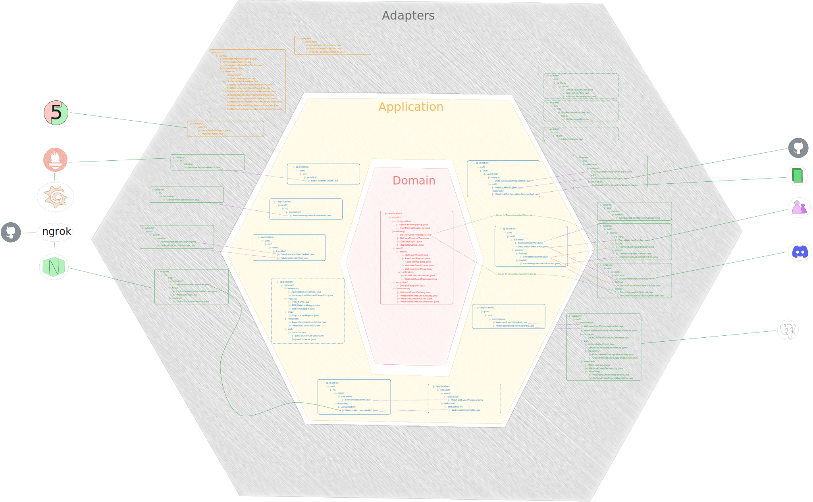

# README Heaxagonal Architecture

## Project layout

- 3 main packages: application, application.domain, adapter (Other layouts do exist)
    - Could also have common, application.common
- Domain must not have any type imported from application
- Application must not have any type imported from adapter
- Adapter may access types in Application or Domain
    - Adapter may also reference Domain directly (if port is in domain)
- Can make decisions:
    - Application must not have any Spring or Jakarta references OR
    - May allow some Spring annotations (@Service, @Transactional) in Application layer
- Application.usecase / service can access application.port.in or application.port.out
  (Necessary in some cases)

## Quick mental model

- Domain = business rules
- Application = use case orchestration
- Adapter = technical details
- Common = shared code, from that layer inwards

The classes in the domain package are anaemic; essentially just data transfer objects. Business logic has been
chosen to be placed in the application package as much as possible.

## Where do ports (contracts) live?

Different authors have different opinions on where ports live.

What matters is who owns the abstraction and what is being protected from change.

In this project:

- Application defines the ports
- Adapters implement (most of) them
- Domain stays pure and dependency-free as much as possible

For this project, this resource was used as a source of inspiration:
[Hexagonal Architecture | HappyCoders.eu](https://www.happycoders.eu/software-craftsmanship/hexagonal-architecture/)

## Pros and Cons:

Pros to using Hexagonal Architecture:

- Intentionally place implementation details in a space where replacement is straightforward, 
  without needing a large refactor
- The domain is kept pure and dependency-free; focussed on Ubiquitous Language ("Business Terms")
- The application layer becomes clean, focused and reusable in the event that an adapter is replaced
- Much easier to onboard new developers:
    - Entry Points are found in the 'IN' package, Exit Points in the 'OUT' package
    - Inserting new code is predictable
- Testing is much easier - only inject what is needed exactly for the test
- Architecture and Structure speaks for itself, and aids in code review

Cons to using Hexagonal Architecture:

- More work to set up
- More rules to be aware of / follow
- Can be overkill for simple projects
- Poorly designed ports can leak implementation details
- Risk of anaemic domain models (domain is just data holder)
  When Hexagonal Architecture Shines

When Hexagonal Architecture Shines:

- Multiple inbound channels (webhooks, polling, async)
- Multiple outbound integrations (vendors, APIs, delivery targets)
- Systems expected to evolve or live long-term
- Teams that value clarity over short-term speed

When It May Be Overkill

- Simple CRUD services
- Prototypes or spike solutions
- Very small teams with short project lifetimes

## Diagram

