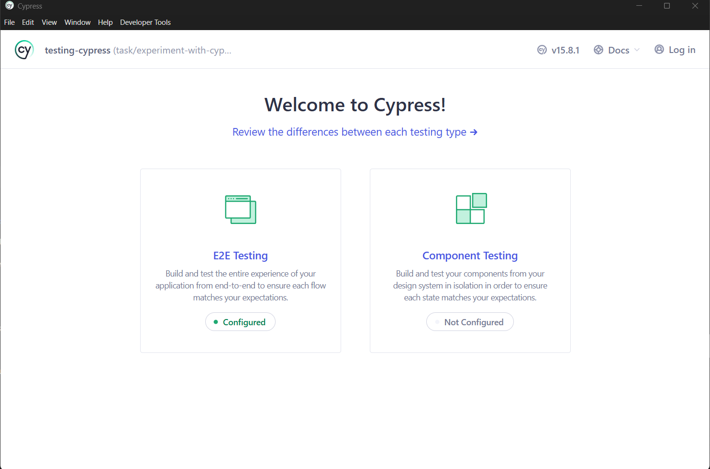
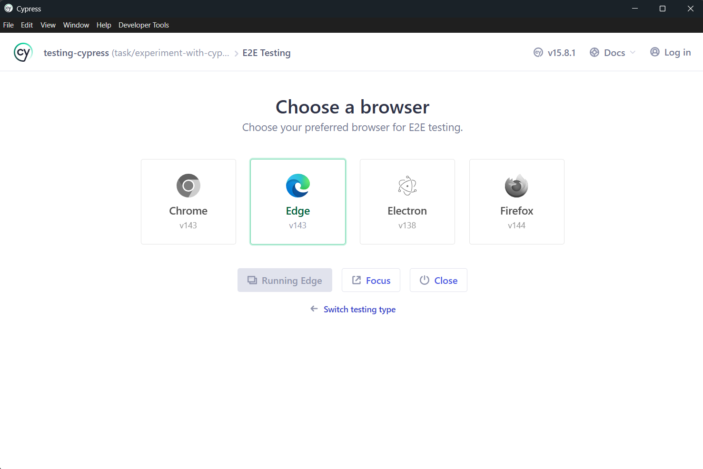
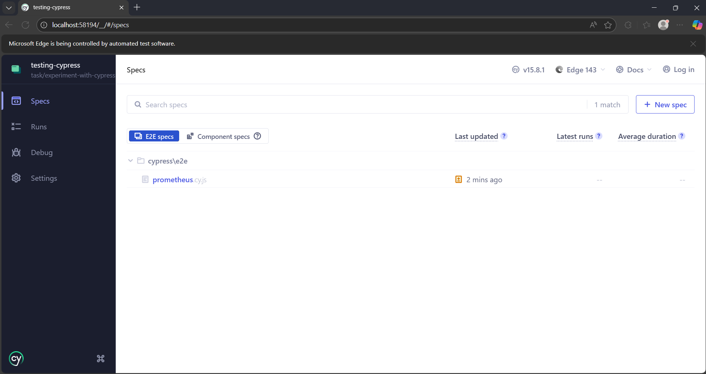
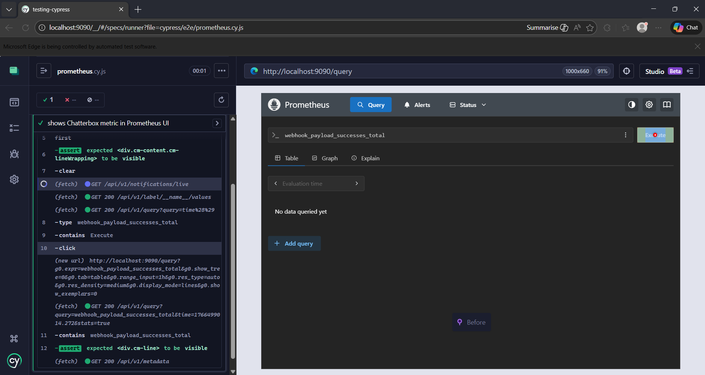

# README Cypress

This note summarises using Cypress as a UI Test tool

## Setup

In your codebase, suppose you have a folder structure:

```
--- client
--- api
```

Inside of the `client` directory, we are going to create a new directory: `cypress`. Inside of that new directory:

```bash

npm init -y
```

```bash
npm install cypress --save-dev
```

```bash
npx cypress open
```

If this is the first time setup of Cypress on the machine, a window will ope asking you to accept some Ts and Cs

You should then be able to see something like this


### E2E Testing

By clicking the E2E Testing section in the Cypress UI, you get some files created for free.

```text
├─ cypress/
│  ├─ fixtures/        ← test data (we won’t need this yet)
│  ├─ support/         ← global hooks & helpers
│  │  ├─ commands.js   ← custom commands (optional)
│  │  └─ e2e.js        ← runs before every test
│  └─ e2e/             ← 👈 THIS is where tests live
├─ cypress.config.js   ← config
└─ package.json
```


## Running Tests

We can either use commands to run the tests (and then generate videos) or we can use the UI.

If using the command-line, checkout the Makefile. 

Else:

In the Cypress UI, we select a browser for our tests to run in


And then by Clicking on the Focus icon (if not automatically redirected):


By clicking on the specific test, it will run


